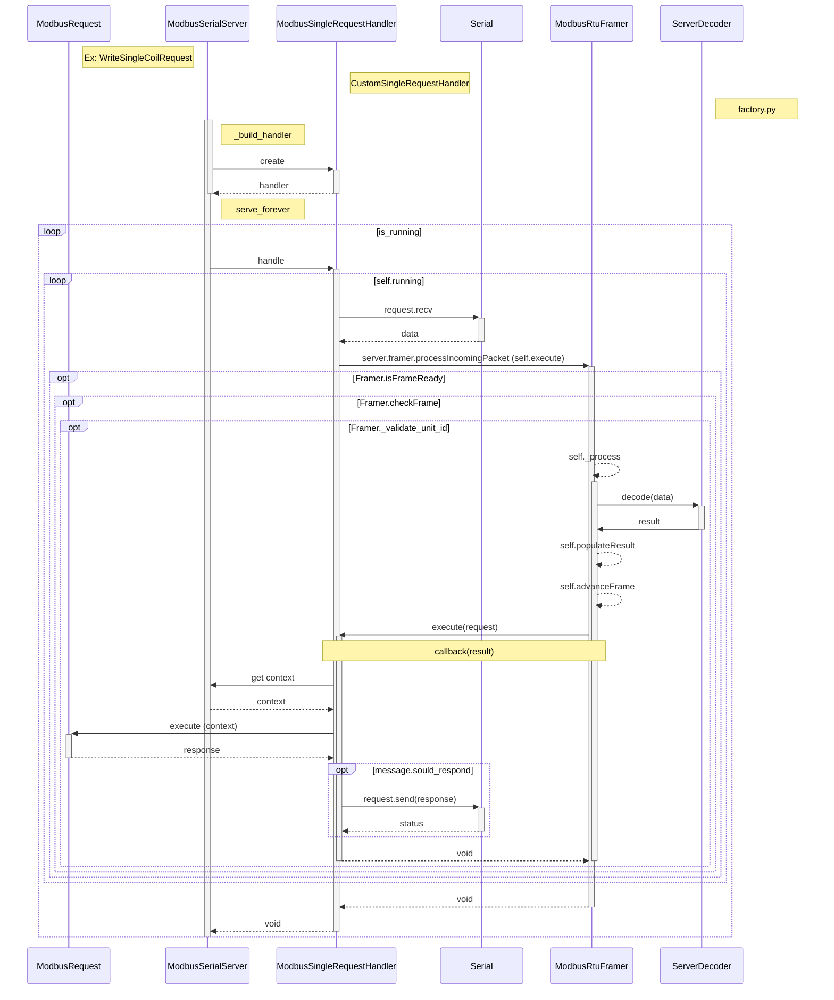

# Pymodbus principles of operation

## Serial sync server
Frame reception diagram:

```mermaid
sequenceDiagram
    
    participant Request as ModbusRequest
    Note right of Request: Ex: WriteSingleCoilRequest

    participant Server as ModbusSerialServer
    participant RH as ModbusSingleRequestHandler    
    Note right of RH: CustomSingleRequestHandler
    participant Serial
    participant Framer as ModbusRtuFramer
    participant Decoder as ServerDecoder
    Note right of Decoder: factory.py

    

    activate Server
        activate Server
        Note right of Server: _build_handler
        
            Server->>+RH: create
            RH-->>-Server: handler
            
        deactivate Server

    Note right of Server: serve_forever
    loop is_running
        Server->>+RH: handle

        loop self.running
            RH->>+Serial: request.recv
            Serial-->>-RH: data

            RH->>+Framer: server.framer.processIncomingPacket (self.execute)
            
            opt Framer.isFrameReady
                opt Framer.checkFrame
                    opt Framer._validate_unit_id                    
                        Framer-->>Framer : self._process
                        activate Framer
                        Framer->>+Decoder: decode(data)
                        Decoder->>-Framer: result
                        Framer-->>Framer : self.populateResult
                        Framer-->>Framer : self.advanceFrame                        
                        Framer->>+RH:execute(request)
                            Note over Framer,RH: callback(result)
                        
                            RH->>Server: get context
                            Server-->>RH: context
                            
                            RH->>+Request:execute (context)
                            Request-->>-RH: response

                            opt message.sould_respond
                                RH->>+Serial: request.send(response)
                                Serial-->>-RH: status
                            end
                        RH-->>-Framer:void
                        deactivate Framer
                    end
                end
            end           
        end
        Framer-->>-RH: void
     RH-->>-Server: void


            

    end

    deactivate Server


```

